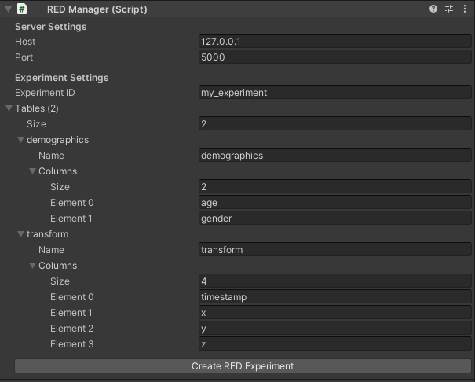
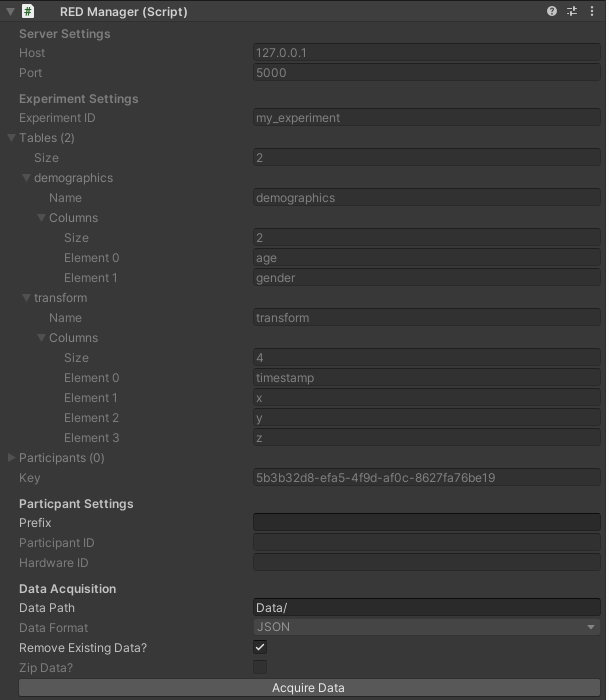
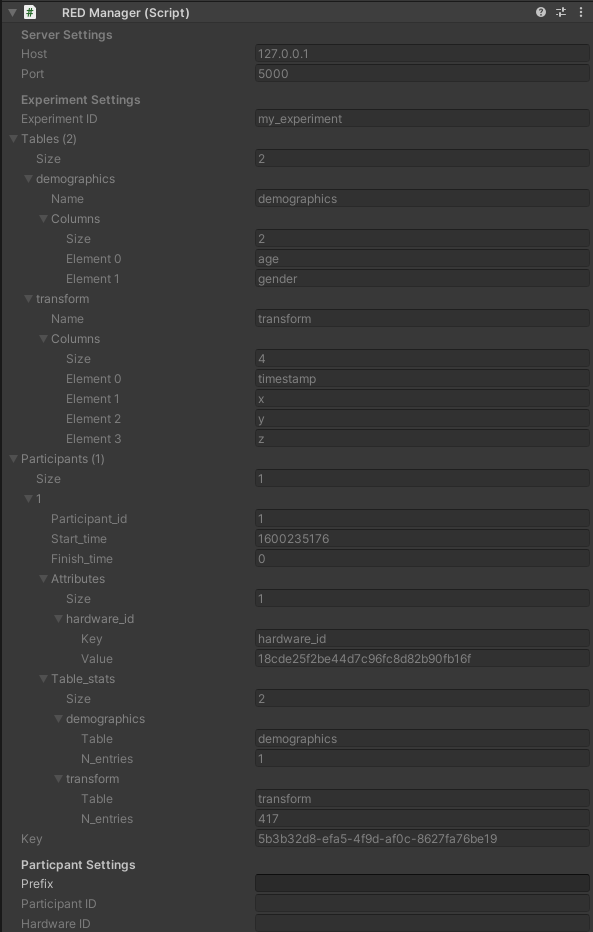

# Unity RED Client
This client consists of the REDManager.cs MonoBehaviour script (that does all of the actual work), and the REDManagerEditor.cs Editor script (that customizes how REDManager appears in the inspector). It is designed so that all interactions with the RED server happen either from the editor (for admin actions), or during playtime (for participant actions).

Here is what the script looks like in the inspector when first created:

In order to create an experiment, you must enter a valid host, port, experiment ID, and tables. **Host** and **port** refer to the RED server. **Experiment ID** must be a name unique to your experiment. If an experiment with the provied ID already exists in the sytem, an error will be returned and the experiment will not be created. **Tables** are how RED stores participant data, and there must be at least one table for the experiment to be created. To create the experiment in the RED system, press the **Create RED Experiment** button. Once this is done though, you cannot edit the experiment properties.

This is the script after the experiment has been created:

The Server Settings and Experiment Settings sections are now read-only, and a list of participants and the experiment key has been added to the Experiment Settings section. The **participants** list shows all of the registered participants. This list updates when acquiring data. It can happen continuously, but for debug reasons it currently does not. The experiment **key** is the key unique to the created experiment provided by the RED server. This key is needed for all further admin actions, such as acquiring data. The Unity client automatically handles this, but the key is exposed here so you can access the experiment from other clients.

Two new sections, Participant Settings, and Data Acquisition are also added. By entering a value for **prefix**, you can add a prefix to participant IDs for all participants who have that build. For example, you could set the prefix to "pilot", build, and distribute to your pilot testers. Then remove the prefix, build, and distribute to your participants. That way your pilot testers and participants are cleanly separated in the database. **Participant ID** and **hardware ID** are populated at runtime, and are exposed mainly for debugging and testing. To download all of the participant data, click the **Acquire Data** button. This will download all of the data to the provided **data path**. If **remove existing data?** is set to true, it will delete everything already existing in **data path**.

This is the script after one participant has completed:

The Unity client automatically adds the **hardware ID** attribute for each user. This is a hex string unique to the hardware that the experiment was run on. The idea was to determine if the same person accidentally has multiple participant IDs. Also provided are the number of entries for each table the participant has.
